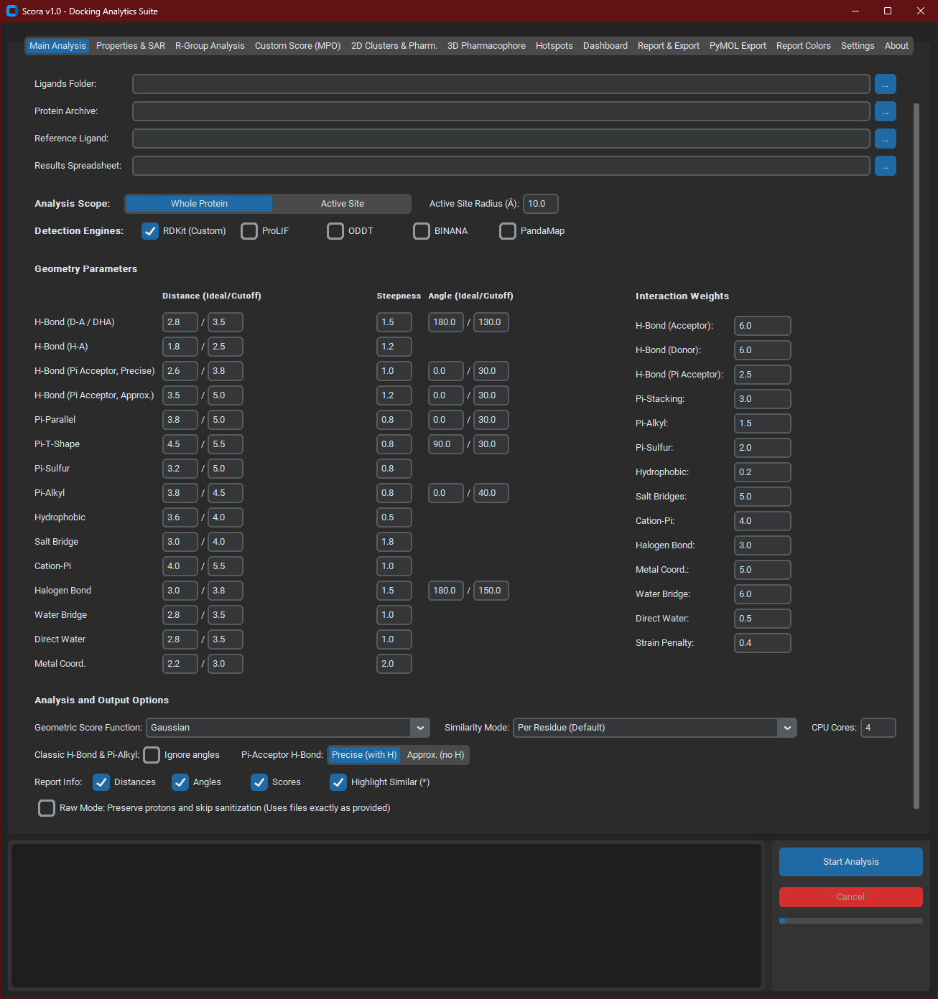

DOWNLOAD

The compiled executable can be downloaded from the Releases section:

👉 https://github.com/Thiago-Wilson/Scora/releases

OBS: The program may take up to 1 minute to open due to file preparation. This is expected for portable executables.
______________________________________________________________________________________________________________________
# Scora

Scora is a computational tool designed to support structure-based drug discovery through automated analysis of protein–ligand complexes.

The software integrates interaction profiling, ligand structural descriptors, and docking score extraction into a unified workflow, enabling researchers to systematically analyze binding modes and evaluate docking results.

Scora was developed to simplify post-docking analysis and facilitate the extraction of structural information from molecular complexes.
_______________________________________________________________________________________________________________________
Platform

Windows standalone executable

No Python installation required

Designed for researchers in:

computational chemistry
structural biology
medicinal chemistry
drug discovery
______________________________________________________________________________________________________________________
## Interface

  

Main Features

Protein–Ligand Interaction Analysis

Scora automatically detects and characterizes several classes of non-covalent interactions commonly observed in biomolecular complexes:

Hydrogen bonds,
Hydrophobic interactions,
π–π stacking,
π–cation interactions,
Salt bridges,
Additional interaction geometries relevant for ligand binding

Interaction data are exported in structured formats suitable for downstream statistical or cheminformatics analysis.
______________________________________________________________________________________________________________________
Ligand Structural Descriptors

Scora computes multiple descriptors frequently used in medicinal chemistry and cheminformatics, including:

Molecular shape descriptors

Surface and geometric properties

Structural complexity metrics

Additional physicochemical parameters relevant for ligand evaluation

These descriptors allow rapid comparison of ligands and support compound prioritization workflows.
_______________________________________________________________________________________________________________________

Docking Result Analysis

Scora can automatically extract relevant scoring information from docking outputs generated by different docking engines, enabling efficient analysis of docking campaigns and comparison of predicted binding poses.
________________________________________________________________________________________________________________________
Typical Applications

Scora can be used in several stages of structure-based drug discovery, including:

Post-docking analysis
Interaction profiling
Ligand prioritization
Structure–activity relationship (SAR) studies
Binding mode comparison
________________________________________________________________________________________________________________________
Quick Start

1. Download the latest release
3. Run Scora.exe
3. Select the docking results directory
4. Start the analysis
_________________________________________________________________________________________________________________________
Future Development

Future versions of Scora aim to expand support for:

additional docking engines
improved structural descriptors
expanded interaction detection
enhanced visualization and reporting tools
________________________________________________________________________________________________________________________
Contributing

Suggestions, feature requests, and bug reports are welcome.

The Scora is completely free, but if you want and are able, please help maintain this project and fund new ones.

https://www.paypal.com/donate/?hosted_button_id=DEJQPDZNZVGCC
________________________________________________________________________________________________________________________
License

BSD-3
________________________________________________________________________________________________________________________

Citation

If you use Scora in your research, please consider citing the project or referencing this repository. 

Thiago Wilson (2026).
Scora: Structural Characterization of Receptor–Ligand Assemblies.
https://github.com/Thiago-Wilson/Scora

Costa, T. et al. Scora: an Integrated Tool for Automated Post-Docking Analysis and Multi-Criteria Ligand Prioritization. 2026
